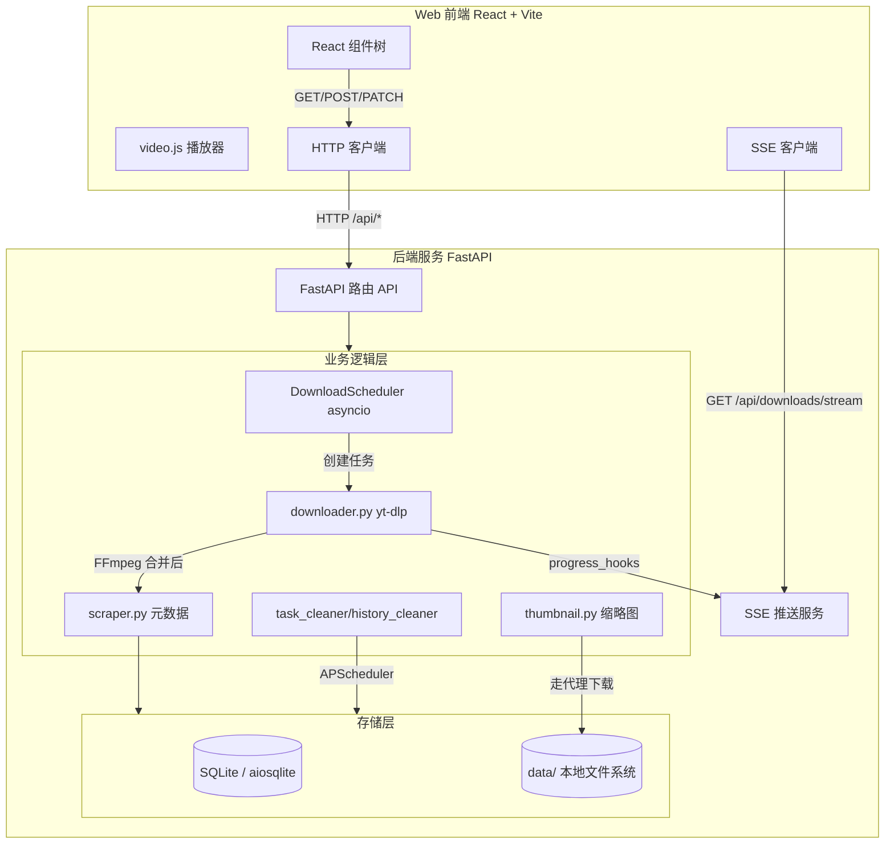
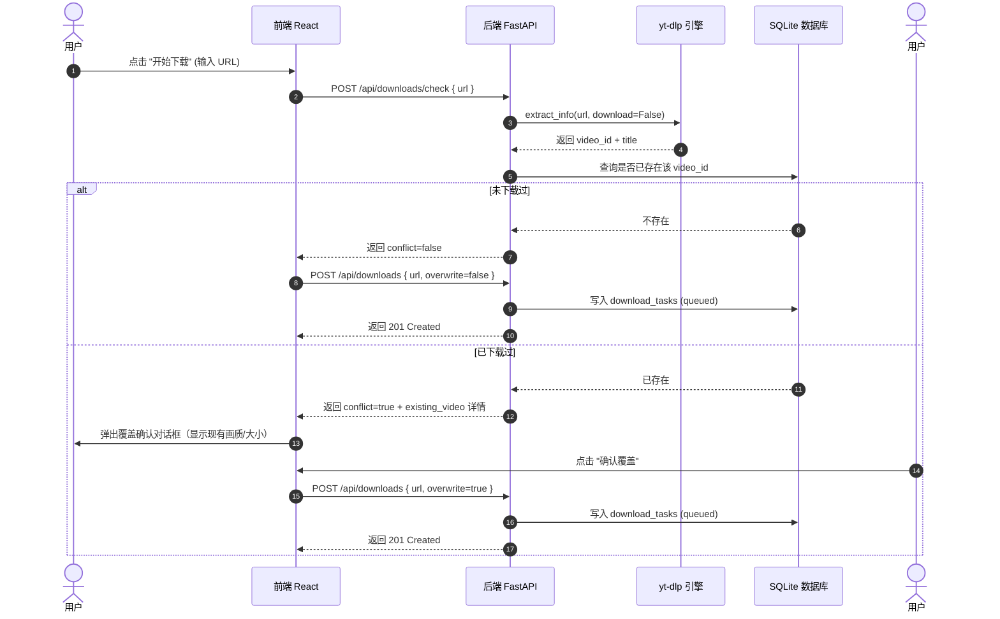

# 00. 整体架构设计

> 来源决策：React 18 + Vite + TS + Vanilla CSS、FastAPI + SQLite、asyncio + Semaphore(2)

## 0.1 整体架构图

TubeHub 采用**前后端分离**架构，通过内网/局域网部署，不包含外部账户体系（无登录、免鉴权模式）。



---

## 0.2 数据流模型（核心路径）

### 0.2.1 添加下载任务（含前置 check 与覆盖确认）



---

## 0.3 关键技术决策记录（ADR）

### ADR-01: 为什么放弃 Celery + Redis，改用 asyncio.create_task + Semaphore(2)？
- **上下文**：后端需要管理下载队列、限制并发。Celery + Redis 是工业界最常用的大型异步任务方案。
- **决策**：在 `TubeHub` 的单用户、局域网部署场景下，Celery 引入的 Redis 依赖和进程开销过重。我们选择使用 **FastAPI 运行循环内的 `asyncio` 线程池（`run_in_executor`）** 以及全局信号量 `asyncio.Semaphore(2)`。
- **优点**：零外部依赖（无需装 Redis）、开发极为迅速、能够直接通过内存变量同步状态而无需繁琐的数据库心跳。

### ADR-02: 为什么选择 video.js 8.x 播放器？
- **决策**：不使用浏览器原生 `<video>` 标签，选用 **video.js**。
- **优点**：
  - 倍速、全屏、画中画 UI 开箱即用。
  - 进度记忆功能可通过 video.js 丰富的事件直接钩入，减少约 150 行前端 UI 控制条代码。
  - 为未来可能的 HLS 码率自适应（VOD）提供了完美的扩展层。

### ADR-03: 为什么缩略图由后端代理下载，而不是直接通过 img.youtube.com 展示？
- **决策**：虽然 img.youtube.com 是公开且无限制的，但在中国大陆内网环境部署时被墙。
- **方案**：FastAPI 后端通过 `httpx`（走系统环境变量中配置的全局 `HTTP_PROXY` 代理）将缩略图下载并缓存到本地 `data/thumbnails/{video_id}.jpg`，再由后端以静态文件/API 吐给前端。

### ADR-04: 为什么移除前端代理配置，改用容器全局系统代理 (.env) 自愈更新？（已确认 ✅）
- **上下文**：旧版设计在前端设置页保存代理，后端保存到数据库。这造成了两个严重问题：
  1. 容器在启动时（Git 拉代码阶段、Pip 包依赖热更新阶段）由于没有容器系统变量代理，会被内网防火墙严格拦截卡死。
  2. 代理信息在前后端、数据库、yt-dlp 调度间被多重传递，耦合性高且难以调试。
- **决策（2026-07-08）**：
  - **彻底移除** 前端系统设置中的 "代理配置"、后端数据库中 `ytdlp_proxy` 字段及全部接口。
  - **全局一元化**：用户统一在宿主机 `.env` 中通过 `HTTP_PROXY` 与 `HTTPS_PROXY` 配置代理。
  - **Docker 运行时自愈**：容器启动时，入口脚本 `entrypoint.sh` 自动读取该代理并注册给全局 Git 和 Pip。启动时容器会全自动执行 `git pull`（版本强同步）和 `pip upgrade`（依赖热升级）。
  - **隐式代理捕获**：由于宿主机/容器环境变量中已存在 `HTTP_PROXY`，后端 `httpx` 抓缩略图、`yt-dlp` 下载视频流会自动、隐式、100% 连通地使用该代理，无需任何手动参数注入。这让系统架构达到了极致的极简和可靠。

---

## 0.4 完整依赖清单（已锁定 ✅）

### 0.4.1 后端 Python 依赖（`backend/requirements.txt`）

```text
fastapi==0.111.0
uvicorn==0.30.1
pydantic==2.7.4
pydantic-settings==2.3.1
sqlalchemy[asyncio]==2.0.30
aiosqlite==0.22.1
yt-dlp==2024.5.27
httpx==0.27.0
loguru==0.7.2
python-multipart==0.0.9
APScheduler==3.11.2
```

### 0.4.2 前端 NPM 依赖（`frontend/package.json`）

```json
{
  "dependencies": {
    "react": "^18.3.1",
    "react-dom": "^18.3.1",
    "react-router-dom": "^6.23.1",
    "video.js": "^8.12.0",
    "lucide-react": "^0.379.0"
  },
  "devDependencies": {
    "@types/react": "^18.3.3",
    "@types/react-dom": "^18.3.0",
    "@types/video.js": "^7.3.58",
    "@vitejs/plugin-react": "^4.3.0",
    "typescript": "^5.2.2",
    "vite": "^5.2.11"
  }
}
```

### 0.4.3 系统依赖（外部）

- **FFmpeg**：`>=8.1`（音频视频自动合并必装）。

---

## Related

- [01-database-schema.md](01-database-schema.md) — 数据库 Schema
- [07-operations.md](07-operations.md) — 部署与运维
