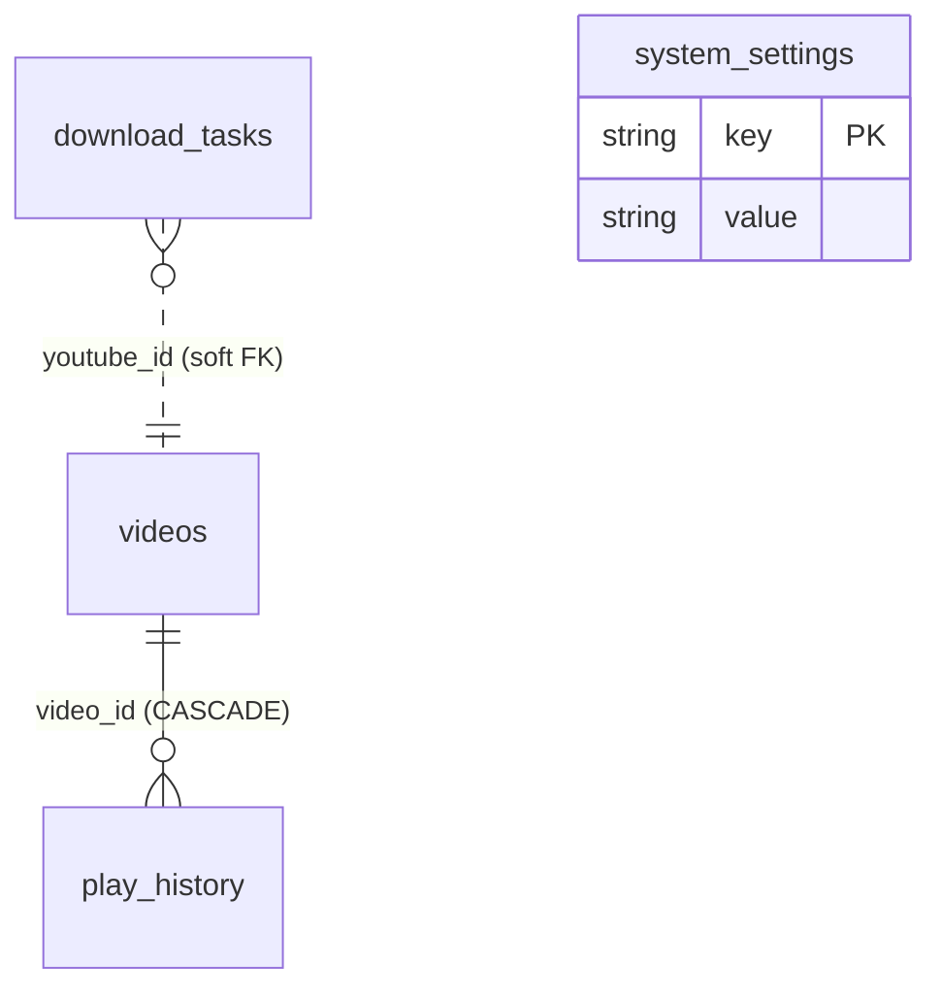

# 01. 数据库 Schema 设计

> 数据库选型：SQLite 3 + SQLAlchemy 2.x (异步 ORM via aiosqlite)

## 1.1 设计原则

1. **无用户表**：本项目为单用户/局域网部署，无账号体系。
2. **字符串 ID 解耦**：YouTube 视频 ID 字段（11 位）与 TubeHub 自增 ID 同时存在，外键统一使用 TubeHub 自增 ID。
3. **级联清理**：通过 SQLite `PRAGMA foreign_keys = ON` 与 `ON DELETE CASCADE` 维持数据完整性（用户删视频自动级联清理 play_history）。
4. **软外键**：download_tasks 与 videos 通过 youtube_id 关联，但不强制外键（一个任务失败时不希望级联删除视频记录）。

## 1.2 表结构总览



## 1.3 完整 SQLAlchemy 模型代码

> 文件位置：`backend/app/models/__init__.py`

```python
from datetime import datetime
from sqlalchemy import (
    Column, Integer, String, Text, Float, Boolean,
    DateTime, Date, ForeignKey, Index, UniqueConstraint
)
from sqlalchemy.orm import declarative_base, relationship

Base = declarative_base()


class Video(Base):
    """视频主表：视频入库后存放在此，download_tasks 仅作流水记录"""
    __tablename__ = "videos"

    id = Column(Integer, primary_key=True, autoincrement=True)
    youtube_id = Column(String(16), nullable=False, unique=True, index=True)
    title = Column(String(512), nullable=False)
    uploader = Column(String(256))
    uploader_id = Column(String(64))
    source_url = Column(Text, nullable=False, default="")
    upload_date = Column(Date)
    duration = Column(Integer)  # 秒

    description = Column(Text)
    thumbnail_path = Column(String(512))

    file_path = Column(Text, nullable=False)
    file_size = Column(Integer)
    width = Column(Integer)
    height = Column(Integer)
    fps = Column(Float)
    vcodec = Column(String(32))
    acodec = Column(String(32))
    container = Column(String(16))
    video_format_id = Column(Integer)       # 选择的视频轨 f ... [HISTORICAL_ARG_TRUNCATED_LEN_191] ... dio_format_id = Column(Integer)       # 选择的音频轨 format_id

    last_position = Column(Float, default=0)
    last_watched_at = Column(DateTime)

    created_at = Column(DateTime, nullable=False, default=datetime.utcnow)

    play_history = relationship(
        "PlayHistory", back_populates="video",
        cascade="all, delete-orphan"
    )

    __table_args__ = (
        Index("idx_videos_uploader", "uploader"),
        Index("idx_videos_created_at_desc", "created_at"),
    )


class DownloadTask(Base):
    """下载任务流水表（生命周期 3 ~ 30 天，详见需求 02 §2.9）"""
    __tablename__ = "download_tasks"

    id = Column(Integer, primary_key=True, autoincrement=True)
    url = Column(Text, nullable=False)
    youtube_id = Column(String(16), index=True)
    title = Column(String(512))
    video_format_id = Column(Integer, nullable=False)  # 必选视频轨 format_id
    audio_format_id = Column(Integer, nullable=False)  # 必选音频轨 format_id

    status = Column(String(16), nullable=False, default="pending", index=True)
    progress = Column(Float, default=0)
    speed = Column(String(32))
    eta = Column(String(16))
    downloaded_bytes = Column(Integer, default=0)
    total_bytes = Column(Integer, default=0)

    error_message = Column(Text)
    save_path = Column(Text)

    # 03 §3.0.1 阶段 ② v3.0 重构：双 format_id 字段
    #   这两个 id 均来自 yt-dlp extract_info(download=False) 返回的 formats 列表
    #   可空以兼容 v2.x 及更早历史任务
    video_format_id = Column(Integer, nullable=True, comment="yt-dlp 视频轨 format_id，如 137")
    audio_format_id = Column(Integer, nullable=True, comment="yt-dlp 音频轨 format_id，如 251")

    # 02 §2.8 自动重试字段
    retry_count = Column(Integer, default=0)
    max_retries = Column(Integer, default=3)
    last_attempt_at = Column(DateTime)

    created_at = Column(DateTime, nullable=False, default=datetime.utcnow)
    updated_at = Column(DateTime, nullable=False,
                        default=datetime.utcnow, onupdate=datetime.utcnow)
    finished_at = Column(DateTime)

    __table_args__ = (
        Index("idx_downloads_created_at_desc", "created_at"),
    )


class PlayHistory(Base):
    """播放历史：30 天后由 APScheduler 自动清理（需求 05 §5.6）"""
    __tablename__ = "play_history"

    id = Column(Integer, primary_key=True, autoincrement=True)
    video_id = Column(Integer, ForeignKey("videos.id", ondelete="CASCADE"),
                      nullable=False, unique=True)
    position = Column(Float, default=0)
    duration = Column(Float, default=0)
    progress_percent = Column(Float, default=0)
    completed = Column(Boolean, default=False)
    first_watched_at = Column(DateTime, nullable=False, default=datetime.utcnow)
    last_watched_at = Column(DateTime, nullable=False, default=datetime.utcnow)
    watch_count = Column(Integer, default=1)

    video = relationship("Video", back_populates="play_history")

    __table_args__ = (
        Index("idx_history_last_watched_desc", "last_watched_at"),
    )


class SystemSetting(Base):
    """通用 KV 存储：仅用于存储 cookies 原始文本（代理现已由 .env 环境变量接管，不存 DB）"""
    __tablename__ = "system_settings"

    key = Column(String(64), primary_key=True)
    value = Column(Text, nullable=False)
    updated_at = Column(DateTime, nullable=False,
                        default=datetime.utcnow, onupdate=datetime.utcnow)
```

## 1.4 启动初始化

> 文件位置：`backend/app/database.py`

```python
from sqlalchemy.ext.asyncio import create_async_engine, AsyncSession
from sqlalchemy.orm import sessionmaker
from .models import Base

DATABASE_URL = "sqlite+aiosqlite:///./data/tubehub.db"
engine = create_async_engine(DATABASE_URL, echo=False, future=True)

AsyncSessionLocal = sessionmaker(
    engine, class_=AsyncSession, expire_on_commit=False
)

async def init_db():
    """启动时建表 + 启用外键约束"""
    async with engine.begin() as conn:
        # 关键：SQLite 必须在每次连接时启用外键，否则 CASCADE 不生效
        await conn.exec_driver_sql("PRAGMA foreign_keys = ON;")
        await conn.run_sync(Base.metadata.create_all)
```

## 1.5 迁移策略（ADR）

- **MVP 阶段**：直接使用 `Base.metadata.create_all()`，不引入 Alembic。
- **生产阶段**：当 Schema 演进到需要保留数据时，引入 Alembic 初始化 baseline。

---

## Related

- [02-api-design.md](02-api-design.md) — RESTful API
- [00-architecture.md](00-architecture.md) — 整体架构