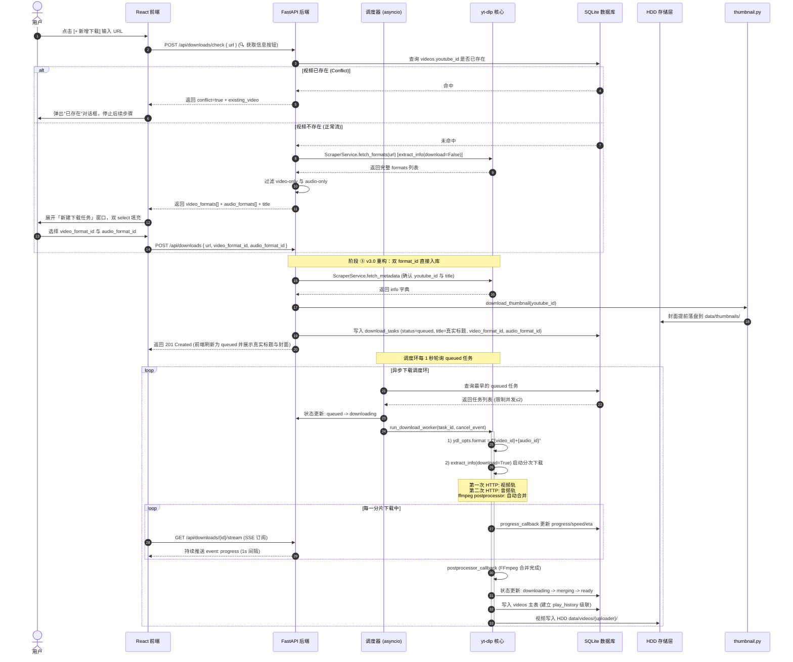
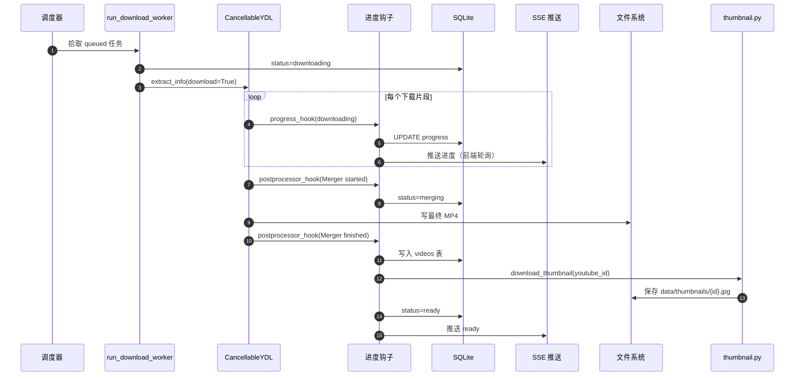

# 03. yt-dlp 集成设计

> 核心服务层设计：调度器 + 下载器 + 取消 + 重试。基于需求 02 §2.2 ~ 2.9 + .learnings/yt-dlp-integration.md

## Revision History

| 版本号 | 日期 | 变更说明 | 作者 |
| :--- | :--- | :--- | :--- |
| v1.0.0 | 2026-07-07 | 初始集成设计 | Gemini CLI |
| v1.1.0 | 2026-07-07 | 追加动态格式、cookies、代理配置与端到端下载流程说明 | Gemini CLI |
| v1.1.1 | 2026-07-10 | 按当前代码修正：单视频流程、格式过滤策略、清理任务状态 | Copilot |
| v1.2.0 | 2026-07-11 | ScraperService 自动读取 cookies；格式过滤 fallback；deno JS 运行时 | Copilot |

---

## 3.x 当前实现对照（2026-07-11）

1. `POST /api/downloads` 当前实现为**单视频任务**，未实现歌单拆解入队。
2. **ScraperService 自动读取 cookies**：`_get_cookies_path()` 自动检测 `data/cookies.txt` 有效性（验证 Netscape 格式），有效则传给 yt-dlp `cookiefile` 参数，解决 Bot 检测问题。
3. **格式过滤双层策略**：
   - 严格层：优先只保留 `mp4+avc1`（视频）/ `m4a+mp4a`（音频），浏览器 100% 兼容。
   - Fallback 层：严格过滤返回空时，自动降级为所有纯视频/纯音频轨（排除 progressive）。
4. worker 下载阶段直接使用已入库的 `video_format_id+audio_format_id`，未再执行运行时二次优选。
5. 缩略图下载由 `httpx.AsyncClient` 依赖 `HTTP_PROXY` 环境变量，无需手动传参。
6. `task_cleaner_loop` / `history_cleaner_loop` **已实现**（Ready 3天 / Failed 30天 / History 30天）。
7. **deno JS 运行时**：yt-dlp 2026.07+ 需要 deno 处理某些受限视频，已在 Dockerfile 安装。
8. **路径对齐**：`_resolve_path` 改用 `os.path.abspath()`，以 CWD=`/app` 为基准，与 volume 挂载一致。

## 3.0 端到端下载处理流程

在 TubeHub 中，用户点击 `[＋ 新增下载]` 到视频成功入库供 Web 播放器播放，共跨越 6 个核心阶段。其整体时序与数据流设计如下：



### 3.0.1 六阶段详解

#### 阶段 ① — 用户发起（前端 UI）
- **触发**：用户在「下载任务」页面右上角点击 `[＋ 新增下载]`（已收纳，视频库主页仅作纯净展示）。
- **参数**：包含 `url`、以及随后从检测阶段得到的 **`video_format_id`** + **`audio_format_id`**。

#### 阶段 ② — 检测冲突（v3.0 重构：拉取真实 list-formats）
- **API**：`POST /api/downloads/check`。
- **按钮 UI 名称**：`🔍 获取信息`。
- **机制**（v3.0）：
  1. **DB 查重**：先查 `videos` 表的 `youtube_id` 字段。命中 → 返回 `conflict=true` + 已有视频信息，**前端立刻弹出"已存在"对话框，停止后续步骤**。
  2. **未命中 → 调 `ScraperService.fetch_formats(url)`**：
     - 在 `asyncio.to_thread` 中执行 `yt_dlp.YoutubeDL({"quiet": True}).extract_info(url, download=False)`。
     - 拿到完整 `formats` 列表后，**严格分类**（已脚本验证）：
       - **视频轨**：`vcodec != "none" && acodec == "none" && vcodec != "images"`（**排除 progressive 与缩略图**）
       - **音频轨**：`vcodec == "none" && acodec != "none"`（**确保单轨道音频**）
       - **缩略图** (sb0-3)：`vcodec == "images"` → 丢弃
       - **Progressive**（含 18 这种音视频混合轨）：`vcodec && acodec 都非 none` → 丢弃，避免与 + 号冲突
     - 对每个轨生成人类可读 `label`：
       - 视频轨：`"{height}p ({ext} · {vcodec} · {tbr:.0f}kbps)"`
       - 音频轨：`"{acodec} ({ext} · {abr:.0f}kbps · {asr/1000:.0f}kHz)"`
  3. **返回响应**：
     ```json
     {
       "conflict": false,
       "youtube_id": "nwMKuChwpMo",
       "title": "【漫士】所以，到底什么是傅里叶变换？",
       "duration": 1567,
       "uploader": "漫士AcadMan",
       "thumbnail_url": "https://...",
       "video_formats": [
         { "id": 137, "label": "1080p (mp4 · avc1.640028 · 2104kbps)", "ext": "mp4", "height": 1080, "vcodec": "avc1.640028", "tbr": 2104.5 },
         ...
       ],
       "audio_formats": [
         { "id": 251, "label": "opus (webm · 122kbps · 48kHz)", "ext": "webm", "acodec": "opus", "abr": 122.8, "asr": 48000 },
         ...
       ]
     }
     ```
  4. **前端拿到响应后**：自动展开「新建下载任务」窗口，两个 select 下拉框已经填好过滤后的数据。
  5. **默认值**：视频 select 默认选 `video_formats[0]`（最高分辨率），音频 select 默认选 `audio_formats[0]`（最高码率）。

#### 阶段 ③ — 任务创建（v3.0：携带 format_id 直接入库）
- **API**：`POST /api/downloads`。
- **请求体**：
  ```json
  {
    "url": "https://www.youtube.com/watch?v=nwMKuChwpMo",
    "video_format_id": 137,
    "audio_format_id": 251
  }
  ```
- **新时序（v3.0）**：
  1. 接收请求后，**仍然先调用 `ScraperService.fetch_metadata`** 拿到真实 `title` 与 `youtube_id`（用于自愈与入库）。
  2. 自动调用 `thumbnail.download_thumbnail` 走代理将封面图落盘。
  3. **写入 `download_tasks` 表**：
     - `video_format_id` = 137
     - `audio_format_id` = 251
     - `status` = **`queued`**
     - `title` 真实值
  4. **调度器拾取时**：直接用 `{video_format_id}+{audio_format_id}` 拼接 yt-dlp format 表达式：
     ```python
     ydl_opts["format"] = f"{task.video_format_id}+{task.audio_format_id}"
     ```
  5. **yt-dlp 内部行为**：
     - 第一次 HTTP 请求：下载 137 视频轨
     - 第二次 HTTP 请求：下载 251 音频轨
     - 自动 postprocessor 调用 `ffmpeg` 合并为一个 mp4
- **歌单处理**：识别 `info['_type'] == 'playlist'` 后，扁平遍历 `entries`，对每个 entry 调一次 `fetch_formats` 拿其专有 formats，再入库；用户可在「新建下载任务」窗口中为每个 entry 单独选 format。

#### 阶段 ④ — 调度器拾取（asyncio 信号量）
- **模块**：`services/scheduler.py` 中的 `scheduler_loop()`。
- **机制**：通过 `asyncio.Semaphore(2)` 全局控制并发。调度协程每秒巡检，将 queued 推进到pending，并在子线程中拉起 worker 进程不阻塞应用主循环。

#### 阶段 ⑤ — Worker 执行（动态格式优选）
- **模块**：`services/downloader.py`。
- **动态选格式**：
  - 先用 `extract_info(download=False)` 获取该视频在 YouTube 的格式数组。
  - 动态过滤出当前高度限制下（例如 `<=720px`）的最佳视频轨 `best_v` 与最佳音频轨 `best_a`。
  - 拼装格式为 `"399+251"` (即 `bestvideo_id+bestaudio_id/best`)，彻底规避因静态映射导致老视频缺少画质而下载报错的崩溃。
  4. **PO-Token 绕过**：强制配置 `player_client = ['default', 'ios', 'android', 'tv', 'web_safari', 'web ... [HISTORICAL_ARG_TRUNCATED_LEN_388] ... ... 仅 5 个；全套必须）。配合您上传的 Netscape Cookies。
- **落盘自愈**：音视频下载完成后，调用 FFmpeg 自动合并为 MP4，写入视频表并自愈视频 Title。
- **缩略图**：调用 `download_thumbnail` 通过代理下载。

#### 阶段 ⑥ — 前端 SSE 实时刷新
- **接口**：`GET /api/downloads/{id}/stream`。
- **机制**：FastAPI `StreamingResponse` 每隔 1s 将进度帧推送至前端 useSSE 钩子，渲染一维单行流进度条，直至 ready/failed/cancelled 时连接优雅断开。

---

## 3.1 文件清单

| 文件 | 职责 |
|------|------|
| `services/scheduler.py` | asyncio 循环 + Semaphore(2) + cancel_events 池 |
| `services/downloader.py` | yt-dlp 封装：opts 构造、钩子、取消、重试 |
| `services/scraper.py` | 元数据提取（单视频 + 歌单） |
| `services/thumbnail.py` | httpx 走代理下载缩略图 |
| `services/task_cleaner.py` | 每日清理 Ready 3 天 / Failed 30 天 |

## 3.2 调度器设计（scheduler.py）

### 3.2.1 核心数据结构

```python
# 全局信号量：限制同时 downloading 的任务数
download_semaphore = asyncio.Semaphore(2)

# 取消事件池：worker 协程可通过它优雅终止
cancel_events: dict[int, asyncio.Event] = {}
```

### 3.2.2 主循环

```python
async def scheduler_loop():
    """每 1 秒检查一次 queued 任务，拾取最多 N 个推进"""
    while True:
        try:
            slots = download_semaphore._value  # 剩余槽位
            if slots <= 0:
                await asyncio.sleep(1)
                continue

            async with AsyncSessionLocal() as db:
                # 按 FIFO 取最早 queued 的任务
                stmt = (select(DownloadTask)
                        .where(DownloadTask.status == "queued")
                        .order_by(DownloadTask.created_at.asc())
                        .limit(slots))
                tasks = (await db.execute(stmt)).scalars().all()

                for task in tasks:
                    task.status = "pending"
                    await db.commit()
                    # 启动 worker 协程（不阻塞调度循环）
                    asyncio.create_task(run_download_worker(task.id))

        except Exception as e:
            logger.exception(f"scheduler_loop error: {e}")
        await asyncio.sleep(1)
```

### 3.2.3 FastAPI 启动钩子

```python
# app/main.py
from contextlib import asynccontextmanager

@asynccontextmanager
async def lifespan(app: FastAPI):
    # 启动
    scheduler_task = asyncio.create_task(scheduler_loop())
    cleaner_task = asyncio.create_task(task_cleaner.schedule())
    yield
    # 关闭
    scheduler_task.cancel()
    cleaner_task.cancel()
```

## 3.3 下载器设计（downloader.py）

### 3.3.1 构造 yt-dlp 选项 (v3.0 双 format_id 严格模式)

```python
def build_ydl_opts(
    task: DownloadTask,
    cookies_path: str | None,
    output_dir: str,
) -> dict:
    """根据任务配置构造 yt-dlp 选项（v3.0）"""
    # 严格按 list-formats 拿到的 format_id 拼接：
    #   e.g. format="137+251"  -> 先下视频轨 137，再下音频轨 251，
    #                                  FFmpeg 自动合并
    format_expr = f"{task.video_format_id}+{task.audio_format_id}"

    return {
        "format": format_expr,        # ❌ 不再使用 /best 兜底
        "merge_output_format": "mp4", # 输出容器强制 mp4
        "outtmpl": f"{output_dir}/%(uploader)s/%(title)s [%(id)s].%(ext)s",
        "quiet": True,
        "no_warnings": True,
        "noplaylist": True,
        "writethumbnail": False,     # 缩略图由后端单独下载

        "cookiefile": cookies_path,
        # 代理由 .env HTTP_PROXY 全局环境变量自动注入，无需手填

        # 绕过 PO-Token 限制
        "extractor_args": {
            "youtube": {
                "player_client": ['default', 'ios', 'android', 'tv', 'web_safari', 'web'],
            }
        },

        # 钩子
        "progress_hooks": [lambda d: progress_callback(d, task.id)],
        "postprocessor_hooks": [lambda d: postprocessor_callback(d, task.id)],
    }
```

### 3.3.2 进度回调

```python
def progress_callback(d: dict, task_id: int):
    """progress_hooks 回调：更新 DB + 通知 SSE"""
    if d["status"] == "downloading":
        total = d.get("total_bytes") or d.get("total_bytes_estimated") or 0
        downloaded = d.get("downloaded_bytes", 0)
        percent = (downloaded / total * 100) if total else 0.0
        speed = d.get("_speed_str", "0 B/s")
        eta = d.get("_eta_str", "00:00")

        # 注意：hook 在子线程中运行，必须用 call_soon_threadsafe 调度到事件循环
        loop = asyncio.get_event_loop()
        loop.call_soon_threadsafe(
            asyncio.create_task,
            update_task_progress(task_id, "downloading", percent, speed, eta, downloaded, total)
        )

    elif d["status"] == "finished":
        # 单个文件下载完成；合并阶段由 postprocessor_hook 接管
        pass
```

### 3.3.3 后处理回调

```python
def postprocessor_callback(d: dict, task_id: int):
    pp = d.get("postprocessor")
    if d["status"] == "started":
        # 进入合并阶段
        loop = asyncio.get_event_loop()
        loop.call_soon_threadsafe(
            asyncio.create_task,
            update_task_status(task_id, "merging")
        )
    elif d["status"] == "finished" and pp == "Merger":
        # 合并完成 → 立即入库
        filepath = d.get("info_dict", {}).get("filepath")
        loop = asyncio.get_event_loop()
        loop.call_soon_threadsafe(
            asyncio.create_task,
            on_download_finished(task_id, filepath)
        )
```

### 3.3.4 取消与重试

```python
class CancellableYDL(yt_dlp.YoutubeDL):
    """继承 YoutubeDL，子类化 _progress_hook 注入取消逻辑"""
    def __init__(self, params: dict, cancel_event: asyncio.Event, **kw):
        super().__init__(params, **kw)
        self._cancel = cancel_event

    def _progress_hook(self, d: dict):
        if self._cancel.is_set():
            raise yt_dlp.utils.DownloadCancelled()
        return super()._progress_hook(d)


async def run_download_worker(task_id: int):
    cancel_event = asyncio.Event()
    cancel_events[task_id] = cancel_event

    async with download_semaphore:
        try:
            task = await get_task(task_id)
            ydl_opts = build_ydl_opts(task, proxy_url, cookies_path, DATA_DIR)

            loop = asyncio.get_running_loop()
            def _sync_download():
                with CancellableYDL(ydl_opts, cancel_event) as ydl:
                    return ydl.extract_info(task.url, download=True)

            info = await loop.run_in_executor(None, _sync_download)
            await on_download_finished(task_id, info)

        except yt_dlp.utils.DownloadCancelled:
            await mark_task_cancelled(task_id)
        except Exception as e:
            await handle_download_failure(task_id, str(e))
        finally:
            cancel_events.pop(task_id, None)


async def handle_download_failure(task_id: int, error: str):
    """失败处理：自动重试 3 次（详见需求 02 §2.8）"""
    async with AsyncSessionLocal() as db:
        task = await db.get(DownloadTask, task_id)
        task.retry_count += 1
        task.error_message = error[:500]
        task.last_attempt_at = datetime.utcnow()

        if task.retry_count <= task.max_retries:
            # 自动重试
            task.status = "queued"
            # 退避：第 1 次立即，第 2 次 30s，第 3 次 2min
            backoff = RETRY_BACKOFFS[task.retry_count]
            task.last_attempt_at = datetime.utcnow() + timedelta(seconds=backoff)
            logger.warning(f"Task {task_id} auto-retry ({task.retry_count}/{task.max_retries})")
        else:
            task.status = "failed"
            task.finished_at = datetime.utcnow()
            logger.error(f"Task {task_id} final fail")
        await db.commit()
```

## 3.4 缩略图下载（thumbnail.py）

```python
async def download_thumbnail(video_id: str, proxy_url: str | None) -> str | None:
    """按 hqdefault → mqdefault → default 降级链下载缩略图"""
    save_path = os.path.join(THUMBNAIL_DIR, f"{video_id}.jpg")
    if os.path.exists(save_path):
        return save_path

    for size in ["hqdefault", "mqdefault", "default"]:
        url = f"https://img.youtube.com/vi/{video_id}/{size}.jpg"
        try:
            async with httpx.AsyncClient(proxy=proxy_url, timeout=10.0) as client:
                r = await client.get(url)
                # YouTube 占位图通常 < 1KB，过滤掉
                if r.status_code == 200 and len(r.content) > 1024:
                    with open(save_path, "wb") as f:
                        f.write(r.content)
                    return save_path
        except Exception as e:
            logger.warning(f"Thumbnail {size} fail: {e}")
            continue

    return "static/placeholder-thumbnail.jpg"  # 全部失败返回默认图
```

## 3.5 数据流：下载到入库



## 3.6 task_cleaner.py

```python
async def cleanup_old_tasks():
    """每日凌晨 3 点清理：Ready 3 天 / Failed & Cancelled 30 天"""
    async with AsyncSessionLocal() as db:
        now = datetime.utcnow()
        # Ready 任务保留 3 天
        r1 = (await db.execute(
            delete(DownloadTask).where(
                DownloadTask.status == "ready",
                DownloadTask.finished_at < now - timedelta(days=3)
            )
        )).rowcount
        # Failed / Cancelled 保留 30 天
        r2 = (await db.execute(
            delete(DownloadTask).where(
                DownloadTask.status.in_(["failed", "cancelled"]),
                DownloadTask.finished_at < now - timedelta(days=30)
            )
        )).rowcount
        await db.commit()
        logger.info(f"Task cleanup: removed {r1} ready, {r2} failed/cancelled")
```

---

## Related

- [01-database-schema.md](01-database-schema.md) — 数据模型
- [02-api-design.md](02-api-design.md) — API 签名
- [.learnings/knowledge/yt-dlp-integration.md](../../.learnings/knowledge/yt-dlp-integration.md) — yt-dlp 调研沉淀