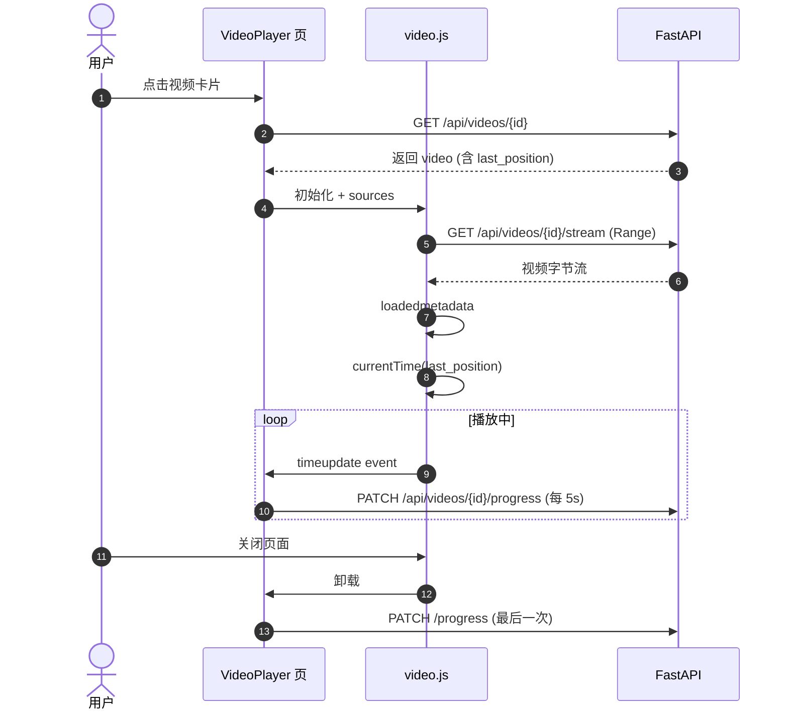

# 04. 前端组件设计

> 技术栈：React 18 + Vite + TypeScript + Vanilla CSS + video.js 8.x

## 4.0 当前实现对照（2026-07-11）

- 路由为 `/`、`/downloads`、`/watch/:id`、`/settings`，无独立历史页。
- `AddDownloadDialog` 挂在 `DownloadTasks` 页面，已修复三处 Bug：
  - `checkedUrl`：检查时锁定 URL，提交使用锁定值（防止输入框清空后提交空 URL 400）
  - `conflict` 字段：与后端 `DownloadCheckResponse` 字段对齐（旧代码用 `exists`）
  - `onCreated`：后端返回 `list`，正确取 `data[0].id`
- `Settings` 页已实现：Cookies 状态展示 + **文件上传（点击/拖拽 .txt）** + 文本粘贴两种方式 + 代理说明。
- 侧边栏支持折叠/展开（汉堡按钮，状态 `localStorage` 持久化，带 CSS 过渡动画）。
- 播放链路已端到端打通：`/api/videos/{id}` 元数据、`/stream` Range 分片、`/progress` 进度记忆全部实现。
- `useSSE` 同时监听具名 `progress` 事件和无名 `message` 事件，兼容两种 SSE 格式。

## 4.1 路由设计

| Path | 组件 | 说明 |
|------|------|------|
| `/` | `<VideoLibrary />` | 视频库首页（网格 + 搜索 + 排序 + 批量删除） |
| `/downloads` | `<DownloadTasks />` | 下载任务列表（含 SSE 进度） |
| `/watch/:id` | `<VideoPlayer />` | 视频播放页 |
| `/settings` | `<Settings />` | 设置（Cookies + Proxy + 清理） |

## 4.2 组件树

```
<App>
├── <Layout>                     // 顶部导航栏 + 路由出口
│   ├── <NavBar />               // Logo + 三个路由入口 + 设置图标
│   └── <Routes>
│       ├── <VideoLibrary />
│       │   ├── <Toolbar />              // 搜索框、排序、新增下载
│       │   ├── <BatchActionBar />       // 选中 ≥1 项时显示
│       │   ├── <VideoGrid>
│       │   │   └── <VideoCard />        // hover 显示多选 + 删除
│       │   ├── <AddDownloadDialog />    // + 添加下载对话框
│       │   └── <ConfirmDialog />        // 单删 / 批量删确认
│       ├── <DownloadTasks />
│       │   ├── <TaskRow />              // 每行任务 + SSE 进度
│       │   └── <BatchCleanBar />
│       ├── <VideoPlayer />
│       │   ├── <VideoJSPlayer />        // 包装 video.js
│       │   └── <VideoMeta />            // 标题/上传者/操作按钮
│       └── <Settings />
│           ├── <CookiesSection />
│           └── <ProxySection />
```

## 4.3 状态管理

本项目**不使用 Redux/Zustand**，使用 React 内置 hooks + 自定义 hook 拆分。

### 4.3.1 自定义 Hooks

| Hook | 文件 | 职责 |
|------|------|------|
| `useSSE` | `hooks/useSSE.ts` | 订阅 SSE，自动重连，组件卸载时关闭 |
| `useTaskProgress` | `hooks/useTaskProgress.ts` | 包装 useSSE，返回 task 当前状态 |
| `useVideos` | `hooks/useVideos.ts` | 视频列表的查询、排序、过滤、批量删除 |
| `useSettings` | `hooks/useSettings.ts` | Cookie 与 Proxy 状态读写 |

### 4.3.2 useSSE 示例

```typescript
// hooks/useSSE.ts
export function useSSE<T>(url: string, onMessage: (data: T) => void) {
  useEffect(() => {
    const es = new EventSource(url);
    es.onmessage = (e) => onMessage(JSON.parse(e.data));
    es.onerror = () => {
      // EventSource 自动重连，但显式记录日志
      console.warn(`SSE disconnected: ${url}`);
    };
    return () => es.close();
  }, [url]);
}
```

## 4.4 VideoCard 设计

```typescript
interface VideoCardProps {
  video: VideoRead;
  selected: boolean;
  onSelect: (id: number) => void;
  onDelete: (id: number) => void;
}

export function VideoCard({ video, selected, onSelect, onDelete }: VideoCardProps) {
  // 已观看 / 已看完角标判定（需求 05 §5.3.3）
  const status = useMemo(() => {
    if (video.last_position === 0) return 'unwatched';
    if (video.last_position >= video.duration * 0.95) return 'completed';
    if (video.last_position > 5) return 'watching';
    return 'unwatched';
  }, [video.last_position, video.duration]);

  return (
    <div className={`video-card ${selected ? 'selected' : ''}`}>
      {/* hover 时显示多选 + 删除 */}
      <input type="checkbox" className="select-checkbox"
             checked={selected} onChange={() => onSelect(video.id)} />
      <button className="delete-btn" onClick={() => onDelete(video.id)}>🗑</button>

      <Link to={`/watch/${video.id}`}>
        
        <span className={`status-badge status-${status}`}>
          {status === 'unwatched' && '🆕'}
          {status === 'watching' && `${Math.round(video.last_position / video.duration * 100)}%`}
          {status === 'completed' && '✓'}
        </span>
        <h3>{video.title}</h3>
      </Link>
    </div>
  );
}
```

## 4.5 VideoJSPlayer 设计（关键集成）

```typescript
// components/VideoJSPlayer.tsx
import videojs from 'video.js';
import 'video.js/dist/video-js.css';
import { useEffect, useRef } from 'react';

interface Props {
  src: string;
  startPosition?: number;        // 进度记忆的恢复位置
  onProgress: (position: number) => void;
}

export function VideoJSPlayer({ src, startPosition = 0, onProgress }: Props) {
  const containerRef = useRef<HTMLDivElement>(null);
  const playerRef = useRef<any>(null);
  const lastReportRef = useRef<number>(0);

  useEffect(() => {
    if (!containerRef.current) return;

    const videoEl = document.createElement('video-js');
    videoEl.classList.add('vjs-big-play-centered', 'vjs-fluid');
    containerRef.current.appendChild(videoEl);

    const player = playerRef.current = videojs(videoEl, {
      controls: true,
      autoplay: false,
      preload: 'auto',
      playbackRates: [0.5, 0.75, 1, 1.25, 1.5, 2],
      sources: [{ src, type: 'video/mp4' }],
    });

    // 元数据加载完成后跳转到上次位置
    player.on('loadedmetadata', () => {
      if (startPosition > 5 && startPosition < player.duration()! - 10) {
        player.currentTime(startPosition);
      }
    });

    // 进度上报（每 5 秒一次）
    player.on('timeupdate', () => {
      const pos = player.currentTime()!;
      if (Math.abs(pos - lastReportRef.current) >= 5) {
        onProgress(pos);
        lastReportRef.current = pos;
      }
    });

    // 暂停时强制上报
    player.on('pause', () => onProgress(player.currentTime() || 0));

    return () => player.dispose();
  }, [src]);

  // 卸载前最后一次上报
  useEffect(() => {
    return () => {
      const pos = playerRef.current?.currentTime();
      if (pos) onProgress(pos);
    };
  }, []);

  return <div ref={containerRef} className="video-js-container" />;
}
```

## 4.6 数据流：用户播放视频



## 4.7 AddDownloadDialog 流程 (v3.0 重构：双 select + 🔍 获取信息 + 1.5x 放大 + 12px 字体)

```typescript
// 1. 用户输入 URL 后点击 [🔍 获取信息]
const handleProbe = async (url: string) => {
  const probe = await fetch('/api/downloads/check', {
    method: 'POST',
    body: JSON.stringify({ url })
  }).then(r => r.json());

  if (probe.conflict) {
    // 命中数据库已存在：弹"已存在"确认框，覆盖才继续
    const ok = await openConfirmDialog({ ... });
    if (!ok) return;
  }

  // 返回 list-formats 动态生成的 video_formats / audio_formats
  setVideoFormats(probe.video_formats); // [{id:137, label:"1080p mp4"}, ...]
  setAudioFormats(probe.audio_formats); // [{id:251, label:"webm 122k opus"}, ...]
};

// 2. 用户在「视频格式」与「音频格式」双 select 中选择完，点 [开始下载]
const handleStartDownload = async (
  url: string,
  videoFormatId: number,
  audioFormatId: number,
  overwrite: boolean
) => {
  await fetch('/api/downloads', {
    method: 'POST',
    body: JSON.stringify({
      url, video_format_id: videoFormatId, audio_format_id: audioFormatId, overwrite,
    }),
  });

  toast.success('下载任务已添加，状态 Queued');
};
```

## 4.8 样式组织

```
frontend/src/styles/
├── reset.css            // CSS reset
├── theme.css            // 设计变量（颜色、间距）
├── layout.css           // 顶部导航、容器布局
├── VideoCard.css
├── AddDownloadDialog.css
├── ConfirmDialog.css
├── VideoPlayer.css
├── Settings.css
└── ...
```

CSS Modules 或纯 BEM 命名规范任选其一，本设计推荐 **BEM**（保持极简）。

---

## Related

- [00-architecture.md](00-architecture.md) — 整体架构
- [02-api-design.md](02-api-design.md) — API 签名

### 4.7.1 UI 视觉规格（用户要求）

- **对话框标题**：**"新增下载"**（v3.0 严谨在功能上隐式，无需再带 "严格格式选择" 后缀）
- **触发按钮**：**"🔍 获取信息"**（取代旧的"检测冲突 (防重下载)"）
- **解析成功后的三行布局**：
  - 第 1 行：Title（YouTube 视频标题，去除 youtube_id 后缀显示）
  - 第 2 行：视频格式 `<select>`（含所有 vcodec != none && acodec == none 的真实可选视频轨）
  - 第 3 行：音频格式 `<select>`（含所有 acodec != none && vcodec == none 的真实可选音频轨）
- **窗口尺寸（用户要求）**：
  - 对话框 `max-width: 1080px`（从 480px → 720px [1.5x] → 1080px [再 1.5x]，共 2.25x 放大）
  - 对话框 `width: 90vw`（小屏自动适配）
  - `padding: 28px`（配合 1.5x 放大）
- **字号（用户要求）**：
  - 对话框 `font-size: 12px`（替代之前的 14px）
  - title display `font-size: 14px`（强调作用，比正文大 2px）
  - label chip `font-size: 11px`（保留细节感）

### 4.7.2 label 格式（用户友好的真实 format_id）

- **视频**：
  ```
  [160] 144p · avc1 · 5MB · mp4 [160]      ← 144p 不带 fps
  [137] 1080p · avc1 · 86MB · mp4 [137]    ← 1080p 默认 30fps
  [394] 144p · av01 · 6MB · mp4 [394]      ← av1 编码
  ```
- **音频**：
  ```
  [139] mp4a · m4a · 10MB · 49kbps · 22kHz [139]
  [140] mp4a · m4a · 26MB · 129kbps · 44kHz [140]
  [251] opus · webm · 25MB · 123kbps · 48kHz [251]
  ```

> label 末尾的 `[137]` / `[140]` 即 yt-dlp `format_id`，提交时直接使用。
