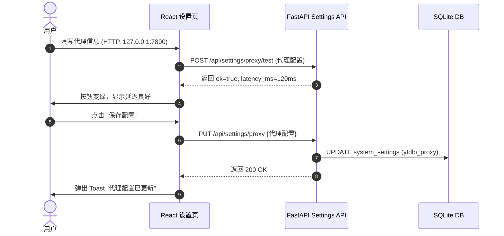

# 05. 设置与系统配置设计

> 数据库表：`system_settings`。对应页面：`<Settings />`。

## 5.1 数据模型

`system_settings` 表用于存放系统全局 KV。

| key | 类型 | value 格式 | 含义 |
|-----|------|------------|------|
| `ytdlp_cookies` | Text | Netscape cookie 纯文本 | 用于突破 YouTube 年龄限制的 Cookie 原始文本 |
| `ytdlp_proxy` | Text | JSON (ProxyConfig) | 下载代理配置（含开关、协议、地址、端口、用户名、密码） |

## 5.2 核心服务设计

> 文件位置：`backend/app/services/settings.py`

```python
import json
import os
from datetime import datetime
from sqlalchemy import select
from ..database import AsyncSessionLocal
from ..models import SystemSetting

COOKIES_FILE_PATH = "data/cookies.txt"


class SettingsService:
    @staticmethod
    async def get_proxy() -> dict:
        """获取代理配置，若不存在返回默认禁用配置"""
        async with AsyncSessionLocal() as db:
            setting = await db.get(SystemSetting, "ytdlp_proxy")
            if not setting:
                return {"enabled": False, "scheme": "http", "host": "", "port": 7890}
            return json.loads(setting.value)

    @staticmethod
    async def set_proxy(proxy_cfg: dict) -> None:
        """保存代理配置"""
        async with AsyncSessionLocal() as db:
            setting = await db.get(SystemSetting, "ytdlp_proxy")
            val = json.dumps(proxy_cfg)
            if not setting:
                db.add(SystemSetting(key="ytdlp_proxy", value=val))
            else:
                setting.value = val
                setting.updated_at = datetime.utcnow()
            await db.commit()

    @staticmethod
    async def get_cookies_status() -> dict:
        """获取 Cookie 文件状态"""
        has_file = os.path.exists(COOKIES_FILE_PATH)
        mtime = None
        size = None
        if has_file:
            stat = os.stat(COOKIES_FILE_PATH)
            mtime = datetime.fromtimestamp(stat.st_mtime)
            size = stat.st_size
        return {"has_cookie": has_file, "updated_at": mtime, "file_size": size}

    @staticmethod
    async def set_cookies(content: str) -> None:
        """上传并保存 Cookie（存 DB + 落盘）"""
        # 1. 写入本地供 yt-dlp 快速调用
        os.makedirs("data", exist_ok=True)
        with open(COOKIES_FILE_PATH, "w", encoding="utf-8") as f:
            f.write(content)

        # 2. 存数据库防丢失（多机或重建时可恢复）
        async with AsyncSessionLocal() as db:
            setting = await db.get(SystemSetting, "ytdlp_cookies")
            if not setting:
                db.add(SystemSetting(key="ytdlp_cookies", value=content))
            else:
                setting.value = content
                setting.updated_at = datetime.utcnow()
            await db.commit()

    @staticmethod
    async def clear_cookies() -> None:
        """清理 Cookie"""
        if os.path.exists(COOKIES_FILE_PATH):
            os.remove(COOKIES_FILE_PATH)
        async with AsyncSessionLocal() as db:
            setting = await db.get(SystemSetting, "ytdlp_cookies")
            if setting:
                await db.delete(setting)
                await db.commit()
```

## 5.3 代理 URL 拼装

在 `backend/app/services/downloader.py` 中拼装代理：

```python
def get_ytdlp_proxy_url(proxy_cfg: dict) -> str | None:
    if not proxy_cfg.get("enabled"):
        return None
    scheme = proxy_cfg["scheme"]
    host = proxy_cfg["host"]
    port = proxy_cfg["port"]
    user = proxy_cfg.get("username", "")
    pwd = proxy_cfg.get("password", "")

    if user:
        return f"{scheme}://{user}:{pwd}@{host}:{port}"
    return f"{scheme}://{host}:{port}"
```

## 5.4 代理连通性测试服务

```python
import httpx
import time

async def test_proxy_connection(proxy_cfg: dict) -> dict:
    proxy_url = get_ytdlp_proxy_url(proxy_cfg)
    start = time.time()
    try:
        # 使用 httpx 通过配置的代理访问 YouTube
        async with httpx.AsyncClient(proxy=proxy_url, timeout=10.0) as client:
            r = await client.get("https://www.youtube.com/", follow_redirects=True)
            latency = int((time.time() - start) * 1000)
            return {
                "ok": r.status_code == 200,
                "latency_ms": latency,
                "status_code": r.status_code,
            }
    except Exception as e:
        return {
            "ok": False,
            "error": f"连接失败: {str(e)}"
        }
```

## 5.5 数据流：更新代理配置



---

## Related

- [01-database-schema.md](01-database-schema.md) — 数据库 Schema
- [03-yt-dlp-integration.md](03-yt-dlp-integration.md) — yt-dlp 调度与参数传入