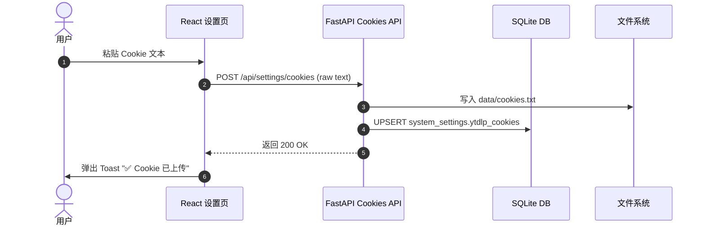

# 05. 设置与系统配置设计

> 数据库表：`system_settings` 仅用于存储 Cookies 原始文本。代理现已由 .env 环境变量接管（详见 ADR-04）。

## Revision History

| 版本号 | 日期 | 变更说明 | 作者 |
| :--- | :--- | :--- | :--- |
| v1.0.0 | 2026-07-07 | 初始版本：支持 Cookies 与代理配置 | Gemini CLI |
| v2.0.0 | 2026-07-08 | **架构重构**：移除 `ytdlp_proxy` 字段及所有代理接口。代理统一切到宿主机 `.env` 环境变量 | Gemini CLI |
| v2.1.0 | 2026-07-11 | 补充 Cookies 安全规范：严禁入库 | Copilot |

---

> ⚠️ **SECURITY — Cookies 严禁提交到 Git**
>
> cookies.txt 包含真实 YouTube 登录凭证（`SID`、`SSID`、`LOGIN_INFO` 等），一旦提交即使删除也会留在历史记录中。
>
> **规范**：
> - `*.txt`、`*_cookies.txt`、`cookies.txt` 已加入 `.gitignore`，任何 cookies 文件严禁 `git add`
> - Cookies 仅通过 TubeHub 设置页上传，存入 `system_settings` 表（DB 不入库）和 `data/cookies.txt`（`data/` 已 ignore）
> - 启动时自动从 DB 恢复到文件，重建容器不丢失

## 5.1 数据模型

`system_settings` 表仅用于存放 Cookies 文本。

| key | 类型 | value 格式 | 含义 |
|-----|------|------------|------|
| `ytdlp_cookies` | Text | Netscape cookie 纯文本 | 用于突破 YouTube 年龄限制的 Cookie 原始文本 |

> ❌ **已废弃字段**：`ytdlp_proxy`（JSON ProxyConfig）。在 v2.0.0 重构中彻底从数据库中移除。
> 现在的代理配置统一在 `backend/.env` 中以 `HTTP_PROXY` / `HTTPS_PROXY` 环境变量形式管理，详见 [00-architecture.md §ADR-04](00-architecture.md)。

## 5.2 核心服务设计

> 文件位置：`backend/app/services/settings.py`

```python
import os
from datetime import datetime
from app.database import AsyncSessionLocal
from app.models import SystemSetting

COOKIES_FILE_PATH = "data/cookies.txt"


class SettingsService:
    @staticmethod
    async def get_cookies_status() -> dict:
        """获取 Cookie 文件状态"""
        has_file = os.path.exists(COOKIES_FILE_PATH)
        mtime = None
        size = None
        if has_file:
            stat = os.stat(COOKIES_FILE_PATH)
            mtime = datetime.fromtimestamp(stat.st_mtime)
            size = stat.st_size
        return {"has_cookie": has_file, "updated_at": mtime, "file_size": size}

    @staticmethod
    async def set_cookies(content: str) -> None:
        """上传并保存 Cookie（存 DB + 落盘）"""
        # 1. 写入本地供 yt-dlp 快速调用
        os.makedirs("data", exist_ok=True)
        with open(COOKIES_FILE_PATH, "w", encoding="utf-8") as f:
            f.write(content)

        # 2. 存数据库防丢失（多机或重建时可恢复）
        async with AsyncSessionLocal() as db:
            setting = await db.get(SystemSetting, "ytdlp_cookies")
            if not setting:
                db.add(SystemSetting(key="ytdlp_cookies", value=content))
            else:
                setting.value = content
                setting.updated_at = datetime.utcnow()
            await db.commit()

    @staticmethod
    async def clear_cookies() -> None:
        """清理 Cookie"""
        if os.path.exists(COOKIES_FILE_PATH):
            os.remove(COOKIES_FILE_PATH)
        async with AsyncSessionLocal() as db:
            setting = await db.get(SystemSetting, "ytdlp_cookies")
            if setting:
                await db.delete(setting)
                await db.commit()
```

## 5.3 全局代理配置（隐式捕获于 .env 环境变量）

### 5.3.1 配置位置

`backend/.env` 文件中通过标准环境变量配置：

```bash
# === 统一全局网络代理 (用于容器内自愈、Git、Pip 及视频下载) ===
# 填入宿主机可达的代理地址 (留空则直连)
HTTP_PROXY=http://10.158.100.9:8080
HTTPS_PROXY=http://10.158.100.9:8080
```

### 5.3.2 隐式捕获机制

`yt-dlp` 与 `httpx` 在发起网络请求时会**自动、隐式**读取系统环境变量中的 `HTTP_PROXY` / `HTTPS_PROXY`：

- ✅ `yt-dlp` 下载视频流：自动走代理
- ✅ `httpx` 拉取缩略图：自动走代理
- ✅ `git` 在容器启动时拉取代码：自动走代理
- ✅ `pip` 在容器启动时升级依赖：自动走代理

**应用层不需要也不应该在代码中手动注入 `proxy` 参数**！

### 5.3.3 Dockerfile 与 entrypoint.sh 配合

详见 [07-operations.md](07-operations.md)。

- `Dockerfile` 构建时使用 `network: host` + `http_proxy` 参数（仅用于前端 npm 与后端 apt 换源）
- `entrypoint.sh` 启动时读取 `.env` 环境变量并自动配置 Git 全局代理

## 5.4 数据流：保存 Cookies



## 5.5 前端设置页 (极简版)

> 文件位置：`frontend/src/components/Settings.tsx`

经过 v2.0.0 重构后，前端设置页**只保留 Cookies 管理**：
- Cookie 状态展示
- Cookie 上传（多行 textarea）
- Cookie 清除
- 极简说明：告知用户全局代理现在通过 `.env` 统一配置

---

## Related

- [00-architecture.md](00-architecture.md) — 整体架构与 ADR-04 决策记录
- [01-database-schema.md](01-database-schema.md) — 数据库 Schema
- [03-yt-dlp-integration.md](03-yt-dlp-integration.md) — yt-dlp 调度与参数传入
- [07-operations.md](07-operations.md) — 容器自愈启动与 .env 配置
