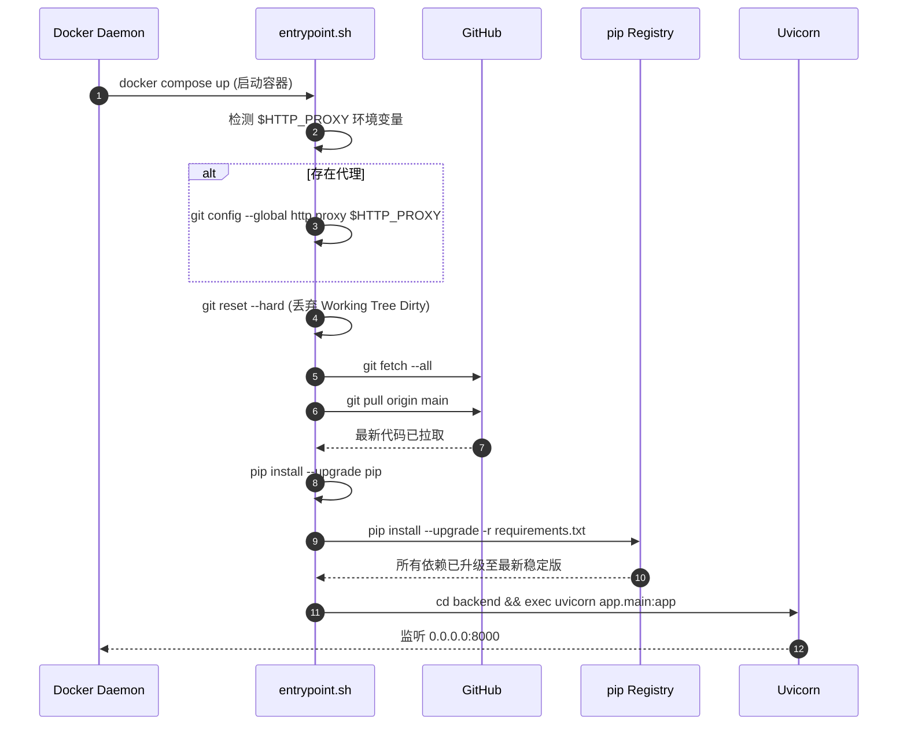
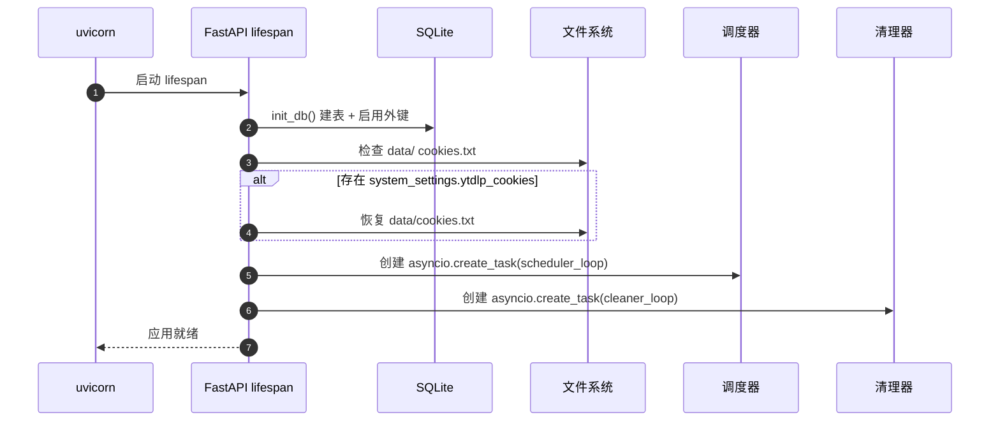

# 07. 部署与运维设计

> 涵盖：启动顺序、健康检查、日志格式、备份/恢复、Docker Compose 启动流程。

## Revision History

| 版本号 | 日期 | 变更说明 | 作者 |
| :--- | :--- | :--- | :--- |
| v1.0.0 | 2026-07-07 | 初始版本 | Gemini CLI |
| v2.0.0 | 2026-07-08 | 新增"容器自愈启动入口"机制（git pull + pip upgrade on boot） | Gemini CLI |

## 7.1 启动顺序

### 7.1.0 容器自愈启动入口（v2.0.0 新增 ✅）

> `backend/app/entrypoint.sh` 是 Docker 容器的统一启动入口。

**核心能力**：
1. 自动读取宿主机 `.env` 中的 `HTTP_PROXY` / `HTTPS_PROXY` 并注册给 Git 全局代理
2. 强行 `git reset --hard` + `git pull` 拉取最新代码（实现版本强同步）
3. `pip install --upgrade pip` + `pip install --upgrade -r requirements.txt`（依赖热升级）
4. 切换到 `backend/` 工作目录，启动 Uvicorn

**执行时序**：


**操作员日常工作流**：
```bash
# 本地有代码更新
git add -A && git commit -m "..." && git push origin main

# 远程仅需重启容器即可一键升级
ssh tcagent-z15 "cd /home/tubehub/repo && docker compose restart tubehub"
```

容器将自动拉取最新代码、升级 Python 依赖、保持容器内代码与 GitHub 强一致。

### 7.1.1 本地 venv 启动

```bash
# 1. 安装依赖
/media/data/venv/bin/pip install -r backend/requirements.txt
cd frontend && npm install

# 2. 初始化数据目录
mkdir -p data/videos data/thumbnails logs

# 3. 创建 .env（如不存在）
cp .env.example .env

# 4. 启动后端（开发模式）
cd /media/data/git/tubehub
/media/data/venv/bin/uvicorn app.main:app --host 0.0.0.0 --port 8000 --reload

# 5. 启动前端（另一终端）
cd frontend && npm run dev
```

### 7.1.2 启动时序



## 7.2 健康检查

### 7.2.1 API 端点

```python
# backend/app/api/health.py
from fastapi import APIRouter
from sqlalchemy import text
from ..database import AsyncSessionLocal

router = APIRouter()


@router.get("/api/health")
async def health():
    checks = {}
    
    # 1. 数据库可达
    try:
        async with AsyncSessionLocal() as db:
            await db.execute(text("SELECT 1"))
        checks["database"] = "ok"
    except Exception as e:
        checks["database"] = f"fail: {e}"
    
    # 2. FFmpeg 可用
    import shutil
    checks["ffmpeg"] = "ok" if shutil.which("ffmpeg") else "missing"
    
    # 3. 磁盘空间
    import shutil
    usage = shutil.disk_usage("data/")
    checks["disk_free_gb"] = round(usage.free / 1024**3, 2)
    
    status = "ok" if all(
        v == "ok" or (isinstance(v, (int, float)) and v > 5)
        for v in checks.values()
    ) else "degraded"
    
    return {"status": status, **checks}
```

### 7.2.2 Docker 健康检查

```dockerfile
HEALTHCHECK --interval=30s --timeout=10s --start-period=30s \
    CMD curl -f http://localhost:8000/api/health || exit 1
```

## 7.3 日志规范

- 路径：`./logs/`
- 滚动：单文件 20MB，最多保留 14 天，启用 gzip 压缩
- 三个独立日志：
  - `tubehub.log`：应用业务日志（DEBUG）
  - `ytdlp.log`：yt-dlp 引擎日志（INFO）
  - `ffmpeg.log`：FFmpeg 输出（INFO）

## 7.4 备份与恢复

### 7.4.1 备份范围

```bash
# 完整备份（推荐每次升级前执行）
tar -czf tubehub-backup-$(date +%Y%m%d).tar.gz \
    data/tubehub.db \
    data/thumbnails/ \
    data/videos/ \
    logs/
```

### 7.4.2 备份策略

| 级别 | 频率 | 保留 | 工具 |
|------|------|------|------|
| 日常备份 | 每周日 02:00 | 保留 4 周 | cron + tar |
| 升级前 | 手动 | 永久 | 手动执行 |

### 7.4.3 恢复流程

```bash
# 1. 停止服务
docker-compose down

# 2. 解压备份
tar -xzf tubehub-backup-20260707.tar.gz

# 3. 重启服务
docker-compose up -d
```

## 7.5 Docker Compose

> 文件位置：`docker-compose.yml` + `Dockerfile`

```yaml
version: "3.9"

services:
  tubehub:
    build: .
    container_name: tubehub
    restart: unless-stopped
    ports:
      - "8000:8000"
    volumes:
      - ./data:/app/data
      - ./logs:/app/logs
    environment:
      - SECRET_KEY=${SECRET_KEY:?required}
      - DATABASE_URL=sqlite+aiosqlite:///./data/tubehub.db
      - DATA_DIR=/app/data
    healthcheck:
      test: ["CMD", "curl", "-f", "http://localhost:8000/api/health"]
      interval: 30s
      timeout: 10s
      retries: 3
```

## 7.6 升级流程

```bash
# 1. 备份
make backup  # 或手动执行 tar

# 2. 拉取最新代码
git pull

# 3. 更新依赖
docker-compose build --pull

# 4. 滚动重启
docker-compose up -d

# 5. 验证健康
curl http://localhost:8000/api/health
```

## 7.7 性能监控（MVP 不集成 Sentry）

- 通过 `logs/tubehub.log` 监控错误率
- 通过 `/api/health` 监控磁盘空间
- 手动检查任务清理是否正常工作

---

## Related

- [00-architecture.md](00-architecture.md) — 整体架构
- [06-error-handling.md](06-error-handling.md) — 错误处理