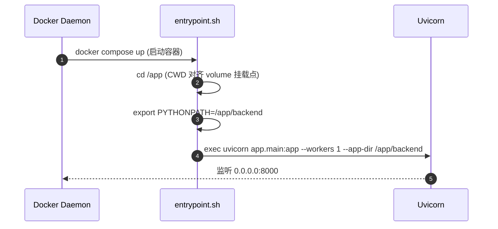
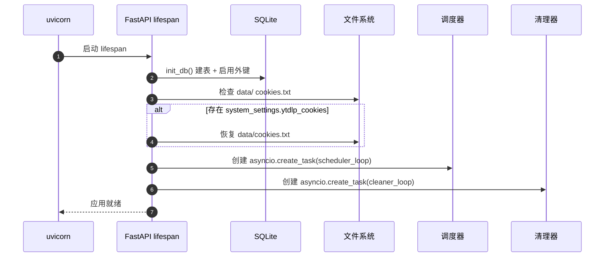

# 07. 部署与运维设计

> 涵盖：启动顺序、健康检查、日志格式、备份/恢复、Docker Compose 启动流程。

## Revision History

| 版本号 | 日期 | 变更说明 | 作者 |
| :--- | :--- | :--- | :--- |
| v1.0.0 | 2026-07-07 | 初始版本 | Gemini CLI |
| v2.0.0 | 2026-07-08 | 新增"容器自愈启动入口"机制（git pull + pip upgrade on boot） | Gemini CLI |
| v2.0.1 | 2026-07-10 | 按当前代码修正 entrypoint 与部署行为说明 | Copilot |
| v2.1.0 | 2026-07-11 | entrypoint CWD 改为 /app + --app-dir；deno 安装；HDD 数据目录迁移 | Copilot |

## 7.1 启动顺序

### 7.1.0 容器启动入口（当前实现）

`backend/app/entrypoint.sh` 是 Docker 容器的统一启动入口。

**当前能力**：
1. 切换工作目录到 `/app`（与 volume 挂载点 `/app/data`、`/app/logs` 对齐）
2. 设置 `PYTHONPATH=/app/backend`
3. 以 `uvicorn app.main:app --host 0.0.0.0 --port 8000 --workers 1 --app-dir /app/backend` 启动

> ⚠️ **关键**：CWD 必须是 `/app` 而非 `/app/backend`，否则 `data/` 相对路径解析为 `/app/backend/data/`，与 volume 挂载的 `/app/data` 不一致，导致 DB/视频/缩略图写到容器内部、重建后丢失。

**执行时序**：


**操作员日常工作流**：
```bash
# 推送代码后，远程重新构建并启动
ssh tcagent-z15 "cd /home/tubehub/repo && git pull && \
  HTTP_PROXY=http://10.158.100.9:8080 HTTPS_PROXY=http://10.158.100.9:8080 \
  docker compose build && \
  HTTP_PROXY=http://10.158.100.9:8080 HTTPS_PROXY=http://10.158.100.9:8080 \
  docker compose up -d"
```

> ⚠️ **代理注意**：宿主机 shell 环境变量优先级高于 `.env` 文件。若宿主机 shell 中已设置旧代理，必须在 `docker compose` 命令前显式覆盖。

### 7.1.1 本地 venv 启动

```bash
# 1. 安装依赖
/media/data/venv/bin/pip install -r backend/requirements.txt
cd frontend && npm install

# 2. 初始化数据目录
mkdir -p data/videos data/thumbnails logs

# 3. 创建 .env（如不存在）
cp .env.example .env

# 4. 启动后端（开发模式）
cd /media/data/git/tubehub
/media/data/venv/bin/uvicorn app.main:app --host 0.0.0.0 --port 8000 --reload

# 5. 启动前端（另一终端）
cd frontend && npm run dev
```

### 7.1.2 启动时序



## 7.2 健康检查

### 7.2.1 API 端点

```python
# backend/app/api/health.py
from fastapi import APIRouter
from sqlalchemy import text
from ..database import AsyncSessionLocal

router = APIRouter()


@router.get("/api/health")
async def health():
    checks = {}
    
    # 1. 数据库可达
    try:
        async with AsyncSessionLocal() as db:
            await db.execute(text("SELECT 1"))
        checks["database"] = "ok"
    except Exception as e:
        checks["database"] = f"fail: {e}"
    
    # 2. FFmpeg 可用
    import shutil
    checks["ffmpeg"] = "ok" if shutil.which("ffmpeg") else "missing"
    
    # 3. 磁盘空间
    import shutil
    usage = shutil.disk_usage("data/")
    checks["disk_free_gb"] = round(usage.free / 1024**3, 2)
    
    status = "ok" if all(
        v == "ok" or (isinstance(v, (int, float)) and v > 5)
        for v in checks.values()
    ) else "degraded"
    
    return {"status": status, **checks}
```

### 7.2.2 Docker 健康检查

```dockerfile
HEALTHCHECK --interval=30s --timeout=10s --start-period=30s \
    CMD curl -f http://localhost:8000/api/health || exit 1
```

## 7.3 日志规范

- 路径：`./logs/`
- 滚动：单文件 20MB，最多保留 14 天，启用 gzip 压缩
- 三个独立日志：
  - `tubehub.log`：应用业务日志（DEBUG）
  - `ytdlp.log`：yt-dlp 引擎日志（INFO）
  - `ffmpeg.log`：FFmpeg 输出（INFO）

## 7.4 备份与恢复

### 7.4.1 备份范围

```bash
# 完整备份（推荐每次升级前执行）
tar -czf tubehub-backup-$(date +%Y%m%d).tar.gz \
    data/tubehub.db \
    data/thumbnails/ \
    data/videos/ \
    logs/
```

### 7.4.2 备份策略

| 级别 | 频率 | 保留 | 工具 |
|------|------|------|------|
| 日常备份 | 每周日 02:00 | 保留 4 周 | cron + tar |
| 升级前 | 手动 | 永久 | 手动执行 |

### 7.4.3 恢复流程

```bash
# 1. 停止服务
docker-compose down

# 2. 解压备份
tar -xzf tubehub-backup-20260707.tar.gz

# 3. 重启服务
docker-compose up -d
```

## 7.5 Docker Compose（当前实际配置）

> 文件位置：`docker-compose.yml` + `Dockerfile`

```yaml
services:
  tubehub:
    build:
      context: .
      dockerfile: Dockerfile
      network: host
      args:
        - HTTP_PROXY=${HTTP_PROXY:-}
        - HTTPS_PROXY=${HTTPS_PROXY:-}
    image: tubehub:latest
    container_name: tubehub
    restart: unless-stopped
    ports:
      - "8000:8000"
    volumes:
      # 数据挂载到 HDD（/home 在 /dev/sda1）
      - /home/tubehub/data:/app/data
      - /home/tubehub/logs:/app/logs
    environment:
      - PYTHONPATH=/app/backend
      - HTTP_PROXY=${HTTP_PROXY:-}
      - HTTPS_PROXY=${HTTPS_PROXY:-}
      - NO_PROXY=localhost,127.0.0.1
      - SECRET_KEY=${SECRET_KEY:-tubehub-change-me-in-production}
    healthcheck:
      test: ["CMD", "curl", "-f", "http://localhost:8000/api/health"]
      interval: 30s
      timeout: 10s
      retries: 3
      start_period: 45s
```

### 宿主机目录结构（tcagent-z15）

```
/home/tubehub/
├── data/               ← 挂载到容器 /app/data（HDD /dev/sda1, 644G 可用）
│   ├── tubehub.db      ← SQLite 数据库
│   ├── cookies.txt     ← YouTube Netscape cookies
│   ├── videos/         ← 下载的视频文件
│   ├── thumbnails/     ← 缩略图缓存
│   └── temp/           ← 临时文件
├── logs/               ← 挂载到容器 /app/logs
└── repo/               ← 代码仓库（不存数据）
```

## 7.6 升级流程

```bash
# 1. 备份
make backup  # 或手动执行 tar

# 2. 拉取最新代码
git pull

# 3. 更新依赖
docker-compose build --pull

# 4. 滚动重启
docker-compose up -d

# 5. 验证健康
curl http://localhost:8000/api/health
```

## 7.7 性能监控（MVP 不集成 Sentry）

- 通过 `logs/tubehub.log` 监控错误率
- 通过 `/api/health` 监控磁盘空间
- 手动检查任务清理是否正常工作

---

## Related

- [00-architecture.md](00-architecture.md) — 整体架构
- [06-error-handling.md](06-error-handling.md) — 错误处理